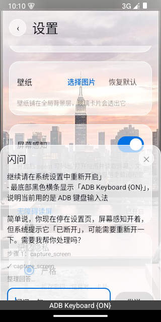
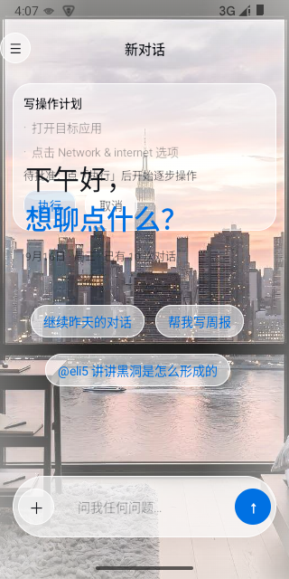
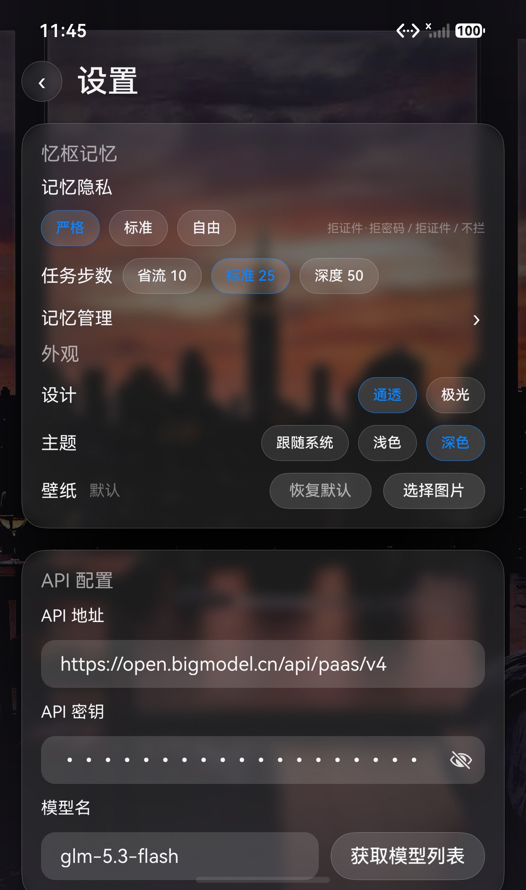
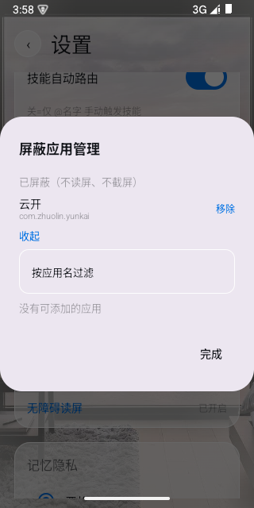

# 云开 Yunkai · 双端手机 AI Agent

打开即对话的本地优先移动端 AI 助手：**agent loop 多步工具调用 + 屏幕感知 + 持久记忆 + 技能系统**，
Android（Kotlin/Compose）与 HarmonyOS NEXT（ArkTS）双端同构实现。

> 设计目标：手机上的"数字助理"——能看屏幕、能动手操作、能记住你的偏好，
> 但每一步写操作都要经你逐条批准。

## 功能总览

| 能力 | Android | HarmonyOS |
|------|---------|-----------|
| Agent loop（多步工具调用/取消/事件流） | ✅ | ✅ |
| 屏幕感知：无障碍读屏 → 结构化控件清单 | ✅ | ✅（文本路线） |
| 屏幕感知：无障碍截图 → 视觉理解 | ✅ | ❌（系统限制，见下） |
| 写操作：计划卡预览 → 逐条批准 → 手势执行 | ✅ | 🚧（已调研，待实施） |
| 三层安全：敏感页护栏 / 每步回显 / 外发二次确认 | ✅ | 🚧 |
| 隐私黑名单（银行/支付类默认拒绝读屏） | ✅ | ✅ |
| 悬浮球 + 半屏闪问面板 | ✅ | → 桌面服务卡片 |
| QS 磁贴快捷入口 | ✅ | → 桌面服务卡片 |
| 闪问独立存档 | ✅ | 🚧 |
| 忆枢记忆引擎（摘要/检索/隐私挡位） | ✅ | ✅ |
| 技能系统（@技能 / 自动路由 / eli5 讲解画布） | ✅ | ✅ |
| 文档附件问答（图片/txt/docx/xlsx/PDF） | ✅ | ✅ |
| 主题三档 + 双皮肤 | ✅ | ✅ |

## 屏幕感知与安全设计

屏幕感知是本项目的核心差异点，安全模型是"**只看不动，除非逐条批准**"：

1. **计划卡**：模型不直接操作手机，只能通过 `propose_plan` 提交动作计划（点击/滑动/输入/返回/Home），
   聊天界面内嵌计划卡展示每一步，用户点「执行」后状态机逐步回显推进；
2. **敏感护栏**：节点树文本命中敏感关键词（支付/转账/验证码等）即进入暂停态，写操作止步；
3. **外发确认**：含文本输入的动作用二段确认位单独把关；
4. **黑名单默认不信**：银行/支付类应用直接拒绝读屏，用户可增补；
5. **视觉兜底**：文字路线读不到的自绘界面走无障碍截图 → 压缩 → 多模态理解（仅 Android；
   HarmonyOS 侧 `ohos.screenshot` 为系统接口，三方无截图通道，该层砍除，详见 `docs/` 设计文档）。

## 截图

| 悬浮球 + 闪问面板 | 写操作计划卡 |
|---|---|
|  |  |

| 鸿蒙端（深色） | 屏蔽应用管理 |
|---|---|
|  |  |

## 构建与运行

两端的模型接入均为 **OpenAI 兼容协议**（自备 base URL 与 API key，仅存设备本地 Preferences/DataStore，不经过任何中间服务器）。

### Android

```bash
cd yunkai-android
# Android Studio 打开，或命令行：
./gradlew assembleDebug          # 产物 app/build/outputs/apk/
./gradlew testDebugUnitTest      # 门1：JVM 单测
```

minSdk 30（无障碍截图 takeScreenshot 需 API 30+）。

### HarmonyOS NEXT

```bash
cd yunkai-harmony
# DevEco Studio 打开（API 26），或命令行：
hvigorw --mode module -p product=default assembleHap
# 设备单测（模拟器/真机在线时）：
hdc shell aa test -b com.zhuolin.yunkai -m entry_test -s unittest OpenHarmonyTestRunner -s class logicTest
```

首次使用：设置页填入端点与 API key → 开启屏幕感知总开关 → 系统设置里授权无障碍服务。

## 测试体系（run-all 三门）

- **门0**：逻辑审查（logic-review 清单）
- **门1**：单测（Android JVM 178+ 用例 / HarmonyOS 模拟器 aa test 80 用例）
- **门2**：模拟器 AI 驱动端到端（`tests/fullflow/manifest.yaml` 声明式验收路径，ADB/ HDC + UI 自动化执行，
  截图证据落 `artifacts/`）

## 目录结构

```
yunkai/
├── yunkai-android/     # Android 端（Kotlin 2.0 / Compose / Room / DataStore / AccessibilityService）
│   └── app/src/main/java/com/zhuolin/yunkai/
│       ├── service/        # AgentLoop / LlmClient / screen/(感知服务+工具+写操作状态机) / memory/
│       ├── store/          # Room + DataStore（会话/闪问/配置）
│       └── ui/             # Chat / Settings / FlashPanel / 计划卡
└── yunkai-harmony/     # HarmonyOS 端（ArkTS API 26 / ArkWeb / RDB）
    └── entry/src/main/ets/
        ├── service/        # AgentLoop / LlmClient / tools/ / screen/
        ├── store/          # RDB + Preferences
        ├── memory/         # 忆枢记忆引擎
        └── pages/          # Chat / Settings / Canvas
```

## License

[MIT](LICENSE)
