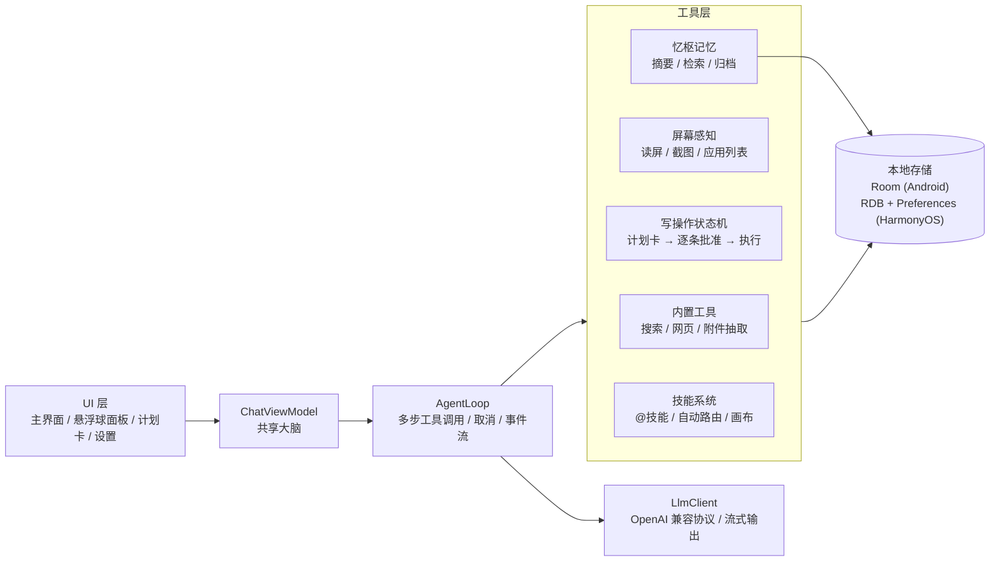

# 云开 Yunkai · 本地手机 AI Agent

<p align="center">
  
  
  
  
  
</p>

<p align="center">
  简体中文 &nbsp;|&nbsp; <a href="README_EN.md">English</a>
</p>

---

## 这是什么？

> **云开是一个装在你手机里的 AI 助手：能看懂屏幕、替你动手操作、长期记住你的偏好——所有数据只存在你的手机上。**

和网页版 AI 聊天不同，云开不是一个聊天窗口，而是一个能"看"和"做"的助手：

- **看** —— 读取当前屏幕上正在显示的内容，知道你在哪个页面；
- **做** —— 替你执行点击、滑动、输入等操作，**每一步都要你确认后才会执行**；
- **记** —— 把你的偏好和重要信息存成本地记忆，越用越懂你；
- **本地** —— API Key、对话记录、记忆全部保存在设备本地，不经手任何中间服务器。

支持 **Android 11+** 与 **HarmonyOS NEXT**，两端界面与能力保持一致。

## 效果演示


## 界面截图

| 主对话 | 写操作确认卡 |
|---|---|
|  |  |

| 悬浮球对话面板 | 屏蔽应用管理 |
|---|---|
|  |  |

## 它能帮你做什么？

| 场景 | 云开的行为 |
|------|-----------|
| 在任何 App 里随手提问 | 点开悬浮球，半屏对话面板直接问，不用切出当前应用 |
| "帮我把这条消息发给张三" | 云开列出将要执行的操作步骤，你逐条确认后它才动手 |
| 不想重复自我介绍 | 它记住你的偏好与常用信息，新对话自动带上 |
| 长文档看不完 | 丢给它 docx / PDF / xlsx / txt / 图片，直接问内容 |
| 想让 AI 更懂某个领域 | 导入自定义"技能"说明书，或使用内置的讲解、军师技能 |

## 功能总览

| 能力 | Android | HarmonyOS NEXT |
|------|:---:|:---:|
| Agent loop（多步工具调用 / 取消 / 流式输出） | ✅ | ✅ |
| 屏幕感知：无障碍读屏 → 结构化控件清单 | ✅ | ✅ |
| 写操作：计划卡预览 → 逐条批准 → 手势执行 | ✅ | ✅ |
| 三层安全：敏感页护栏 / 每步回显 / 外发二次确认 | ✅ | ✅ |
| 隐私黑名单（银行 / 支付类默认拒绝读屏） | ✅ | ✅ |
| 悬浮球 + 半屏 / 全屏对话面板（底色三档） | ✅ | ✅ |
| 快捷设置磁贴入口 | ✅ | ✅ |
| 忆枢记忆引擎（摘要 / 检索 / 隐私挡位） | ✅ | ✅ |
| 技能系统（@技能 / 自动路由 / 讲解画布，双内置） | ✅ | ✅ |
| 文档附件问答（图片 / txt / docx / xlsx / PDF） | ✅ | ✅ |
| 主题三档 + 双皮肤 | ✅ | ✅ |

## 技术亮点

- **双端原生同构** —— Android（Kotlin 2.0 / Compose）与 HarmonyOS NEXT（ArkTS）各自原生实现同一套 Agent 能力，能力与交互保持一致，不是跨端框架套壳。
- **屏幕感知安全模型** —— 模型永远不能"直接操作手机"：它只能提交动作计划（点击 / 滑动 / 输入 / 返回），用户在计划卡中逐条批准，执行过程逐步回显。
- **忆枢记忆引擎** —— 本地 BM25 检索 + 会话摘要 + 三级隐私挡位；严格挡位下，说出口的敏感信息不会进入可检索的记录。
- **提示注入防御** —— 工具返回的一切外部内容（网页 / 搜索结果 / 文档）统一标注为"不可信数据"，其中出现的指令性文字不会被执行，阻断"网页里藏指令操纵助手"一类攻击链。
- **零依赖文档解析** —— docx / xlsx 用 zip + XML 自研抽取，PDF 本地直读，文档内容不出设备、不经第三方服务。
- **全链路可测** —— Android 200+ JVM 单测、HarmonyOS 81 用例，外加模拟器上 AI 驱动的端到端验收路径。

## 架构


```mermaid
flowchart LR
    UI["UI 层\n主界面 / 悬浮球面板 / 计划卡 / 设置"] --> VM["ChatViewModel\n共享大脑"]
    VM --> Loop["AgentLoop\n多步工具调用 / 取消 / 事件流"]
    Loop --> Tools
    subgraph Tools [工具层]
        Builtin["内置工具\n搜索 / 网页 / 附件抽取"]
        Screen["屏幕感知\n读屏 / 截图 / 应用列表"]
        Write["写操作状态机\n计划卡 → 逐条批准 → 执行"]
        Memory["忆枢记忆\n摘要 / 检索 / 归档"]
        Skill["技能系统\n@技能 / 自动路由 / 画布"]
    end
    Loop --> LLM["LlmClient\nOpenAI 兼容协议 / 流式输出"]
    Tools --> Store[("本地存储\nRoom (Android)\nRDB + Preferences (HarmonyOS)")]
    Memory --> Store
```

- **Android**：Kotlin 2.0 / Compose / Room / DataStore / AccessibilityService（`takeScreenshot` 需 API 30+，故 minSdk 30）
- **HarmonyOS**：ArkTS / API 26 / RDB / Preferences / 无障碍扩展（独立进程）

## 安全与隐私

云开的设计原则是"**只看不动，除非逐条批准**"，围绕这条原则有七道防线：

1. **计划卡**：写操作只能以"计划"形式提交，聊天界面内嵌计划卡逐步展示，用户点「执行」后状态机才推进；
2. **敏感护栏**：屏幕内容命中敏感关键词（支付 / 转账 / 验证码等）即进入暂停态，写操作止步；
3. **外发确认**：包含文字输入的动作单独走二次确认；
4. **黑名单默认不信**：银行 / 支付类应用直接拒绝读屏，用户可自行增补；
5. **隐私挡位**：读屏与对话内容按挡位脱敏，严格挡位下转录不入库；
6. **注入防御**：外部内容一律视为数据而非指令（见技术亮点）；
7. **附件防线**：文档解析设大小上限与内容截断，防资源耗尽。

## 构建与运行

两端的模型接入均为 **OpenAI 兼容协议**：自备 base URL 与 API key，仅存设备本地，不经过任何中间服务器。

### Android

```bash
cd yunkai-android
# Android Studio 打开，或命令行：
./gradlew assembleDebug          # 产物 app/build/outputs/apk/
./gradlew testDebugUnitTest      # JVM 单测
```

minSdk 30（无障碍截图 `takeScreenshot` 需 API 30+）。已在 MIUI 真机完成验证。

### HarmonyOS NEXT

```bash
cd yunkai-harmony
# DevEco Studio 打开（API 26），或命令行：
hvigorw --mode module -p product=default assembleHap
```

首次使用：设置页填入端点与 API key → 开启屏幕感知总开关 → 系统设置里授权无障碍服务。

## 测试

| 层 | 内容 |
|---|---|
| 代码审查 | 提交前按 checklist 逐项走查 |
| 单元测试 | Android JVM **200+** 用例 / HarmonyOS **81** 用例 |
| 端到端验收 | 模拟器上 AI 驱动的全链路路径，ADB / HDC + UI 自动化执行，截图留证 |

双端共享同一组忆枢测试向量（检索 / 迁移 / 隐私闸门），逐字节一致。

## License

[MIT](LICENSE)
