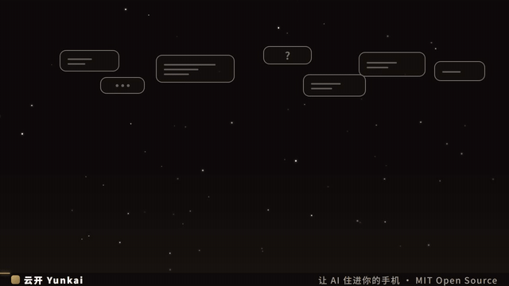
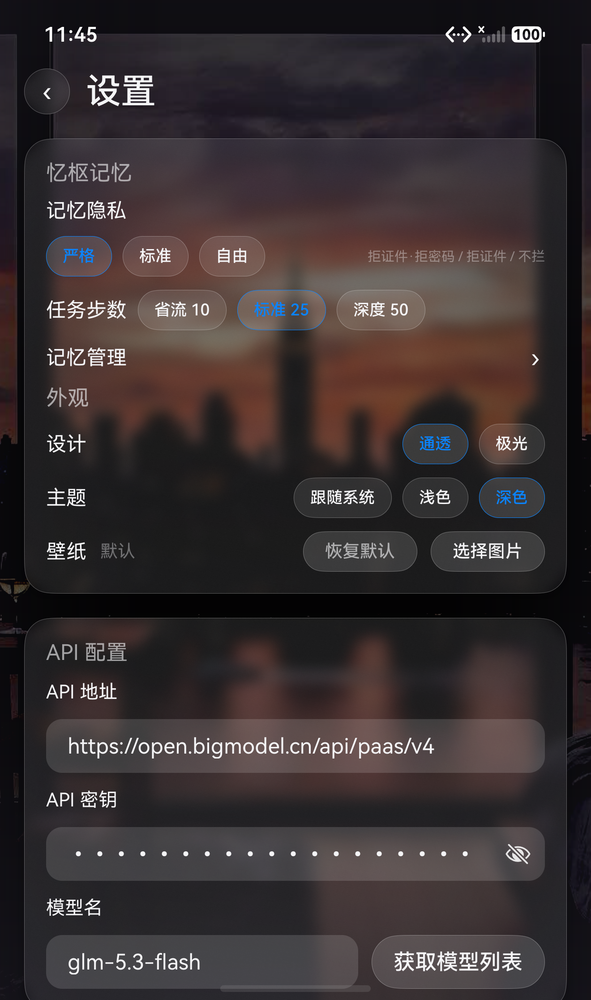
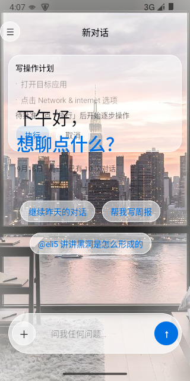
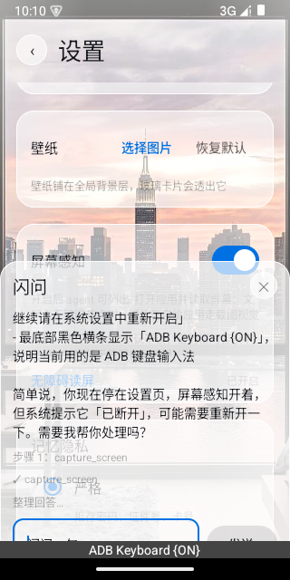
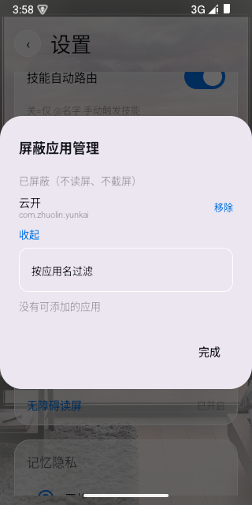
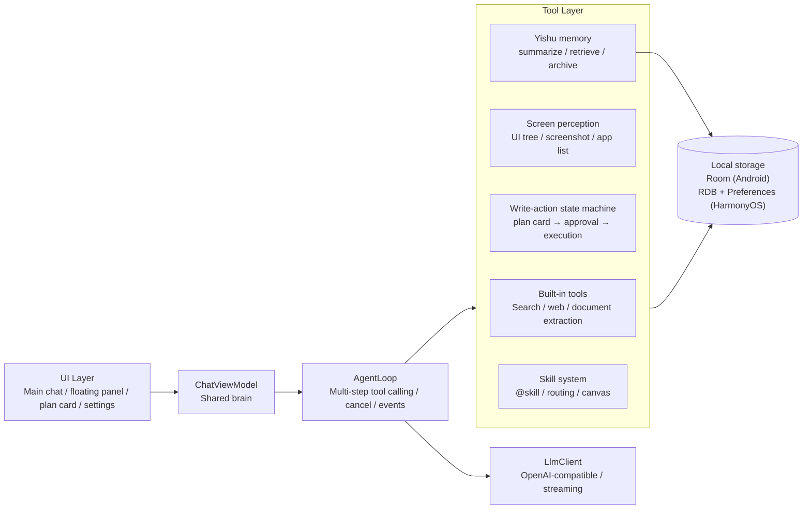

# Yunkai · Local-First Phone AI Agent

<p align="center">
  
  
  
  
  
</p>

<p align="center">
  <a href="README.md">简体中文</a> &nbsp;|&nbsp; English
</p>

---

## What is Yunkai?

> **Yunkai is an AI assistant that lives on your phone: it reads your screen, operates apps on your behalf, and remembers your preferences over time — while all data stays on the device.**

Unlike web-based AI chat, Yunkai is not a chat window. It is an assistant that can **see** and **act**:

- **See** — it reads what is currently on your screen and understands which page you are on;
- **Act** — it performs taps, swipes and typing for you, **with every step requiring your confirmation first**;
- **Remember** — it stores your preferences and important facts as local memory, getting more personal over time;
- **Local** — your API key, conversations and memory live entirely on the device. No middleman servers involved.

Available for **Android 11+** and **HarmonyOS NEXT**, with consistent UI and capabilities on both.

## Demo



## Screenshots

| Main chat | Write-action approval card |
|---|---|
|  |  |

| Floating-ball chat panel | Blocked-apps manager |
|---|---|
|  |  |

## What can it do for you?

| Scenario | What Yunkai does |
|----------|------------------|
| Ask something while inside any app | Tap the floating ball and chat in a half-screen panel without leaving the app |
| "Send this message to Zhang" | Yunkai lists the exact steps it plans to perform; each step runs only after you approve it |
| Stop repeating yourself | It remembers your preferences and key facts, and brings them into new conversations automatically |
| Drowning in documents | Hand it docx / PDF / xlsx / txt / images and just ask about the content |
| Make AI an expert in your field | Import your own "skill" playbooks, or use the built-in explainer and advisor skills |

## Features

| Capability | Android | HarmonyOS NEXT |
|------|:---:|:---:|
| Agent loop (multi-step tool calling / cancel / streaming) | ✅ | ✅ |
| Screen perception: accessibility tree → structured UI list | ✅ | ✅ |
| Write actions: plan card preview → per-step approval → gesture execution | ✅ | ✅ |
| Three-layer safety: sensitive-page guard / per-step echo / outbound confirmation | ✅ | ✅ |
| Privacy blacklist (banking / payment apps denied from screen reading by default) | ✅ | ✅ |
| Floating ball + half/full-screen chat panel (3 opacity levels) | ✅ | ✅ |
| Quick-settings tile entry | ✅ | ✅ |
| Yishu memory engine (summarization / retrieval / privacy levels) | ✅ | ✅ |
| Skill system (@skill / auto routing / explainer canvas, two built-ins) | ✅ | ✅ |
| Document Q&A (images / txt / docx / xlsx / PDF) | ✅ | ✅ |
| Three theme levels + two skins | ✅ | ✅ |

## Engineering Highlights

- **Dual native implementations** — the same agent capabilities are implemented natively twice: Kotlin 2.0 / Compose on Android and ArkTS on HarmonyOS NEXT. Consistent capabilities and interactions, no cross-platform shell.
- **Screen-perception safety model** — the model can never "directly operate the phone": it can only propose an action plan (tap / swipe / input / back), which the user approves step by step in a plan card, with live feedback during execution.
- **Yishu memory engine** — on-device BM25 retrieval + conversation summarization + three privacy levels; at the strictest level, sensitive values you speak are never stored into searchable records.
- **Prompt-injection defense** — all external content returned by tools (web pages / search results / documents) is uniformly marked as untrusted data; instruction-like text inside it is never executed, breaking "hidden instructions in web pages manipulate the assistant" attack chains.
- **Dependency-free document parsing** — docx / xlsx extracted via a self-built zip + XML parser, PDF read locally; document content never leaves the device.
- **Testable end to end** — 200+ Android JVM unit tests, 81 HarmonyOS test cases, plus AI-driven end-to-end acceptance paths on emulators.

## Architecture



- **Android**: Kotlin 2.0 / Compose / Room / DataStore / AccessibilityService (`takeScreenshot` requires API 30+, hence minSdk 30)
- **HarmonyOS**: ArkTS / API 26 / RDB / Preferences / accessibility extension (separate process)

## Safety & Privacy

Yunkai's design principle: "**look but don't touch, unless approved step by step**". Seven lines of defense:

1. **Plan cards**: write actions can only be submitted as a "plan", shown step by step in an in-chat card; execution starts only after you tap Run;
2. **Sensitive guard**: when on-screen text hits sensitive keywords (payments / transfers / verification codes), the agent pauses and write actions stop;
3. **Outbound confirmation**: actions involving typed text go through a separate double confirmation;
4. **Blacklist by default**: banking / payment apps are denied from screen reading out of the box; users can add more;
5. **Privacy levels**: screen and conversation content are redacted according to the chosen level; at the strictest level transcripts are not stored;
6. **Injection defense**: external content is always treated as data, never as instructions (see Engineering Highlights);
7. **Document guard**: parsing enforces size limits and content truncation to prevent resource exhaustion.

## Build & Run

Model access on both platforms is via the **OpenAI-compatible protocol**: bring your own base URL and API key, stored on-device only.

### Android

```bash
cd yunkai-android
# Open in Android Studio, or from the command line:
./gradlew assembleDebug          # output at app/build/outputs/apk/
./gradlew testDebugUnitTest      # JVM unit tests
```

minSdk 30 (accessibility screenshots require API 30+). Verified on real MIUI devices.

### HarmonyOS NEXT

```bash
cd yunkai-harmony
# Open in DevEco Studio (API 26), or from the command line:
hvigorw --mode module -p product=default assembleHap
```

First run: enter endpoint and API key in Settings → enable Screen Perception → grant the accessibility service in system settings.

## Testing

| Layer | Content |
|---|---|
| Code review | checklist-based walkthrough before merging |
| Unit tests | Android JVM **200+** cases / HarmonyOS **81** cases |
| End-to-end | AI-driven full-path acceptance on emulators, executed via ADB / HDC + UI automation with screenshot evidence |

Both platforms share the same Yishu test vectors (retrieval / migration / privacy gate), byte-for-byte identical.

## License

[MIT](LICENSE)
